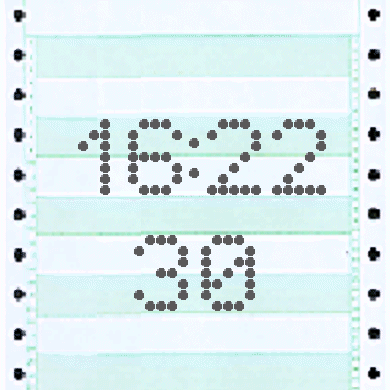

# garmin watch face 390x390 dot matrix print look

I bumped the API to 5.0 and am trying to understand the wide range of coding styles in the samples.  
This is the first bitmap background that I'm using, and there are a lot of code samples that use, for example layers or other fancy instantiations of background classes, but we're only supposed to draw in onUpdate(). 